# Assignment 3 Demo Instruction

## Tech Stack Used
The tech stack used in the implementation of Authentication includes:
Authentication Service:
- BCrypt
- JWT

API Gateway:
- NGINX

## Setting Up
Step 1: Download the source code from Assignment 3 release tag and unzip the file.
- Tags can be found [here](https://github.com/CS3219-AY2324S1/ay2324s1-course-assessment-g09/tags)

Step 2: Open Docker Desktop
- Launch Docker Desktop

Step 3: Go to the directory:
- `ay2324s1-course-assessment-g09/development/`


Step 4: Run the docker compose command `docker-compose up --build`

Wait for containers to setup
- When the docker compose is complete, you should see this:
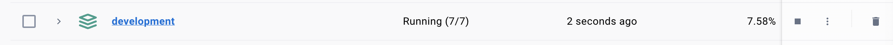


Step 5: Go to: `http://localhost:3000` 
- It should be the sign-in page
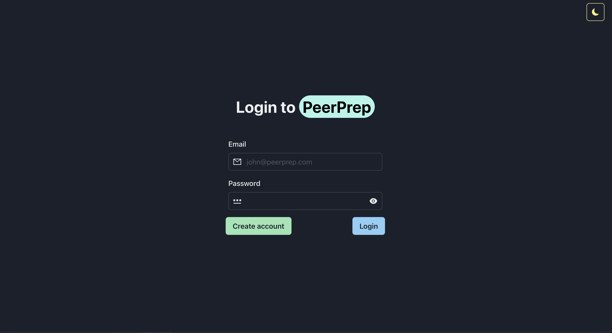

## Demonstration

The demonstration for Assignment 3 will officially start here.
  
The requirements are as follows:
- Demonstrate user authentication for accessing question
- Demonstrating session management (e.g. on page refresh)
- Demonstrating authorization management using the mentioned roles
	1. A designated maintainer role whose privileges allow users to update and delete the questions in the question repository.
	2. Registered users should be allowed to read the questions from the question repository.
	3. Unauthenticated and unauthorized users should not be allowed to access questions (either for reading or updating).


### 1. Demonstrate Unauthenticated Redirection
Attempt to visit `localhost:3000/` which is the dashboard page. Since unauthenticated, the expected result is to be redirected to the sign-in page

Demonstrates: 
- "Unauthenticated and unauthorized users should not be allowed to access questions"


### 2. Admin Access
1. Login using demo account "admin@peerprep.com" with password "12345678" or create in sign-up page. 
2. Admin view allows Creation, Read, Update, Delete of questions. 
	- Create 1 question while in admin account
3. Sign out from admin account
	- `localhost:3000/` no longer accessible

Demonstrates: 
- Sign Out:"Session management" 
- Admin Account:"Designated Maintainer Role"
- Viewing Question:"Registered users should be allowed to read the questions from the question repository.

Sign In:
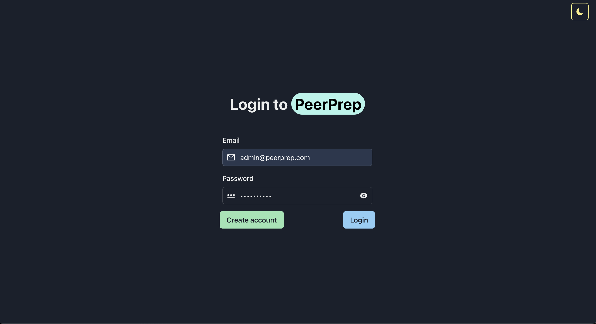

Create Question:
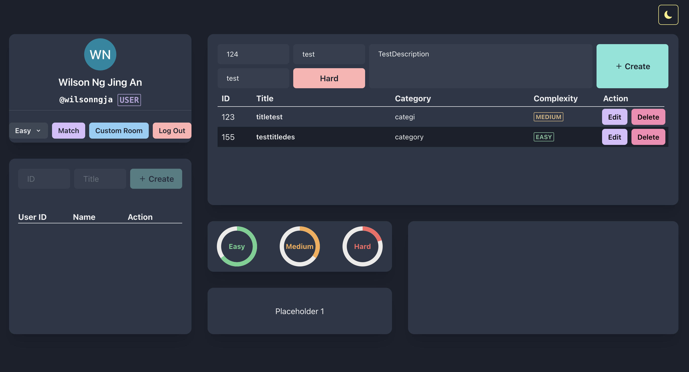


### 3. User Access
1. Sign out from admin account, and create a user account at `http://localhost:3000/signup`.
	- Note: this account will be used in Step 4 Postman/Insomnia
2. Sign in to newly created account
	- User view does not allow adding, editing or deleting questions

*Keep user account signed-in to effects Postman / Insomnia in next step


Demonstrates:
- Viewing Question:"Registered users should be allowed to read the questions from the question repository.
- User Account:"Designated Maintainer Role"

Create Account:
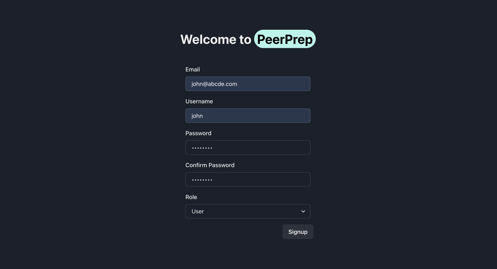

User View:
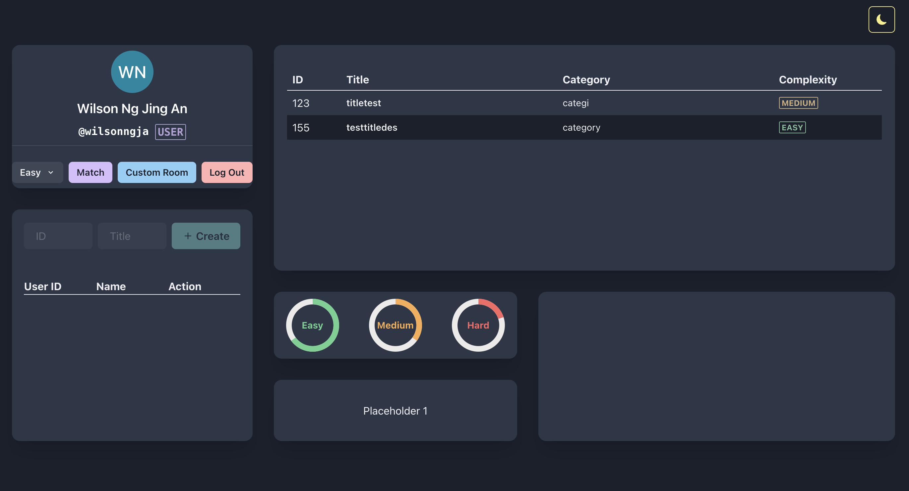

### 4. Postman / Insomnia

Request URL and Content:
1. Get Question(GET): `localhost:3000/question_service/questions/`
  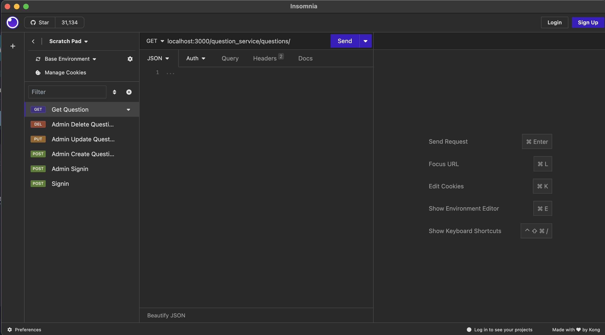
2. Create Question(POST): `localhost:3000/question_service/admin/questions`
	```
	{
	"category": "create category",
	"complexity": "Easy", 
	"description": "create description",
	"qn_num": 1,
	"title": "create title"
	}
	```
  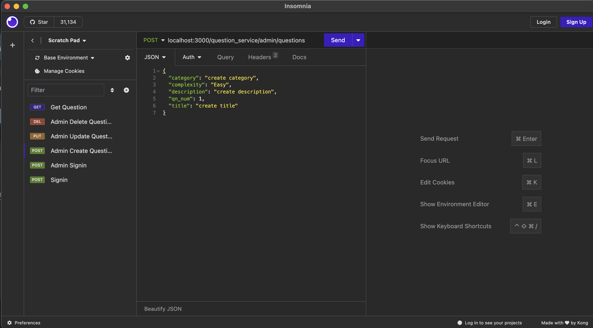
3. Update Question(PUT): `localhost:3000/question_service/admin/questions/1`
	```
	{
	"category": "update category",
	"complexity": "Medium", 
	"description": "Updated description",
	"qn_num": 1,
	"title": "updated title"
	}
	```
  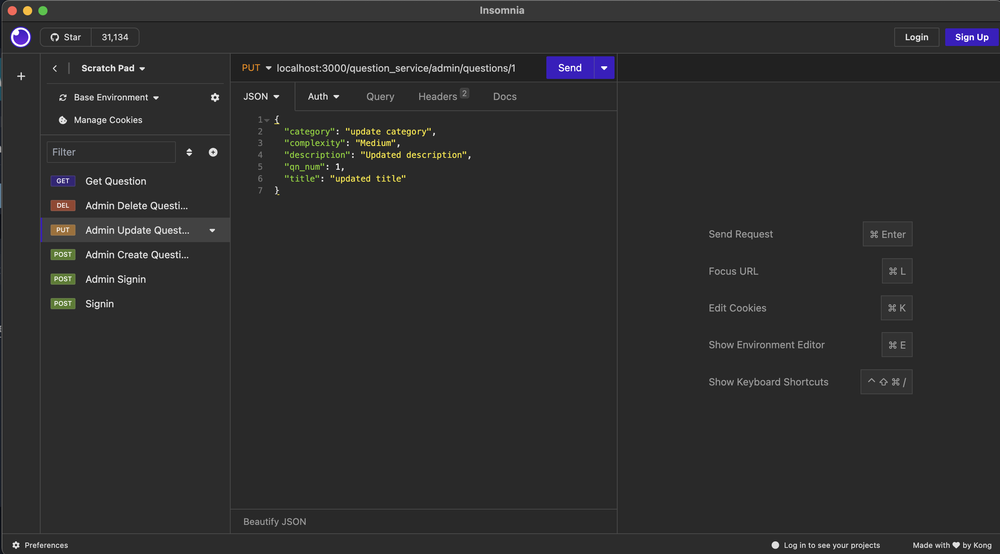
4. Delete Question(DELETE): `localhost:3000/question_service/admin/questions/1`
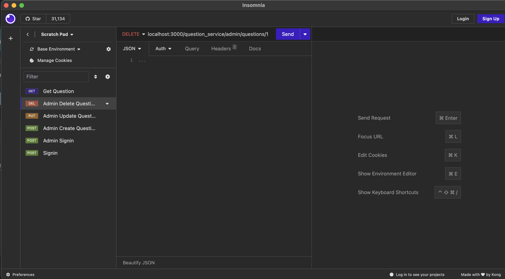
5. Admin Signin (POST): `localhost:3000/auth_service/userauth/signin`
```
{
	"email": "admin@peerprep.com",
	"password": "12345678"
}
```
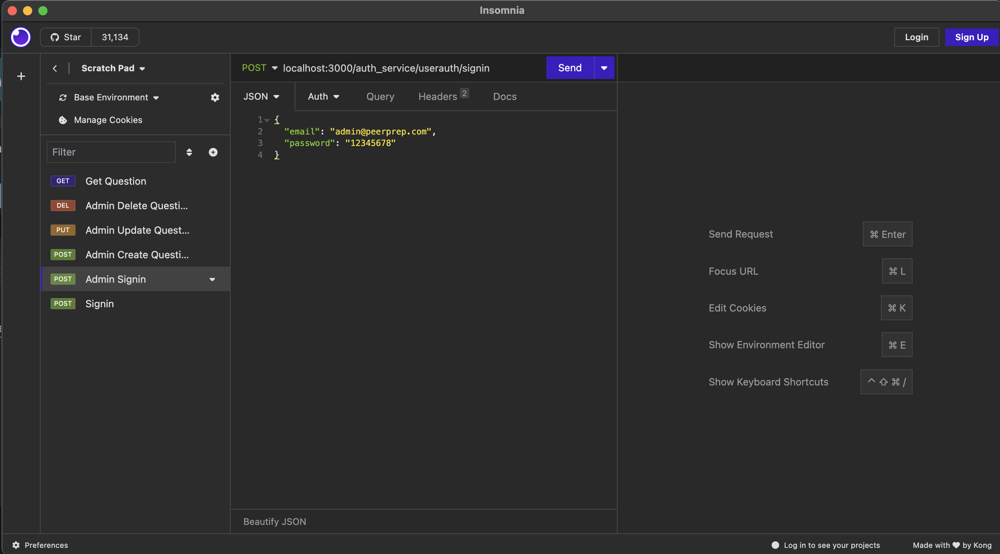
6. User Signin (POST): `localhost:3000/auth_service/userauth/signin`
	- This should be the account created in step "3. User Access"
	```
	{
	"email": "john@abcde.com",
	"password": "12345678"
	}
	```
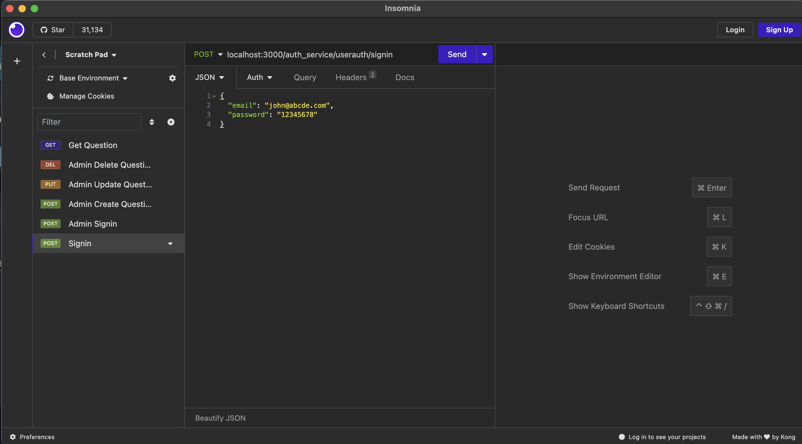
*Note*: 2, 3, 4 are admin-only 


1. Unauthenticated
	- Make request (1), (2), (3), (4) on Postman/Insomnia 
	- All request should be unauthorized since not authenticated
2. User Authenticated
	- Make request (6), (1), (2), (3), (4) on Postman/Insomnia
	- Request (6), (1) will be successful while the others are unauthorized
	- Only admin can create, update, delete questions but all user can read
3. Admin Authenticated
	- Delete token in cookie from previous step
	- Make request (5), (1), (2), (3), (4)
		- All should successful as admin has full access to all actions
		- *Note*: request should be executed in order as Update & Delete acts on same question

Demonstrates:
- Demonstrate user authentication for accessing question
- Demonstrating session management (e.g. on page refresh)
- Demonstrating authorization management using the mentioned roles
	1. A designated maintainer role whose privileges allow users to update and delete the questions in the question repository.
	2. Registered users should be allowed to read the questions from the question repository.
	3. Unauthenticated and unauthorized users should not be allowed to access questions (either for reading or updating).

