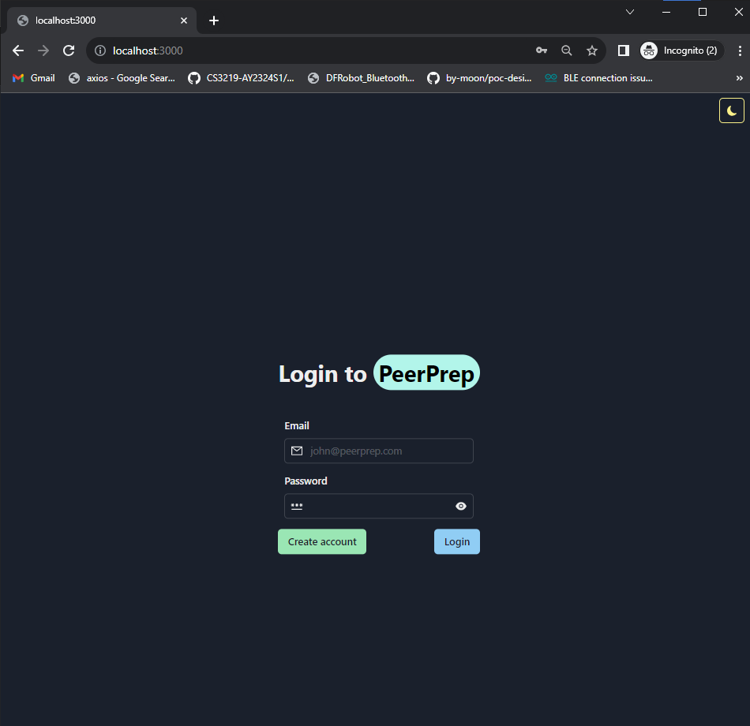
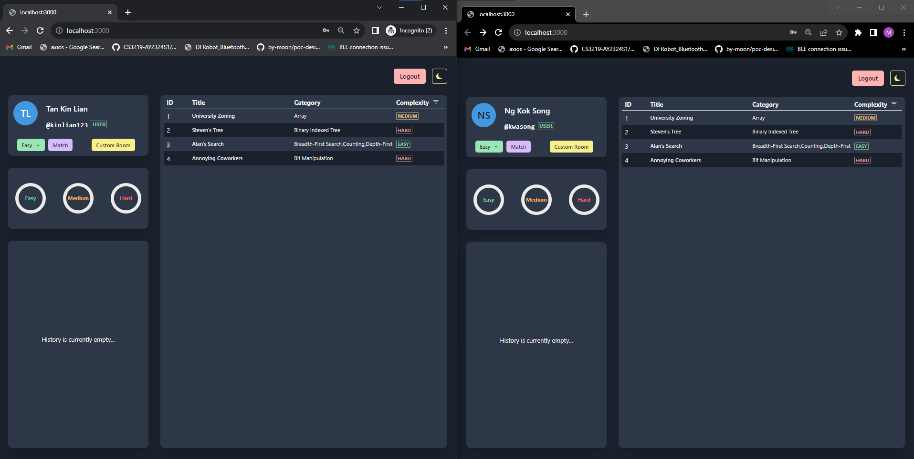
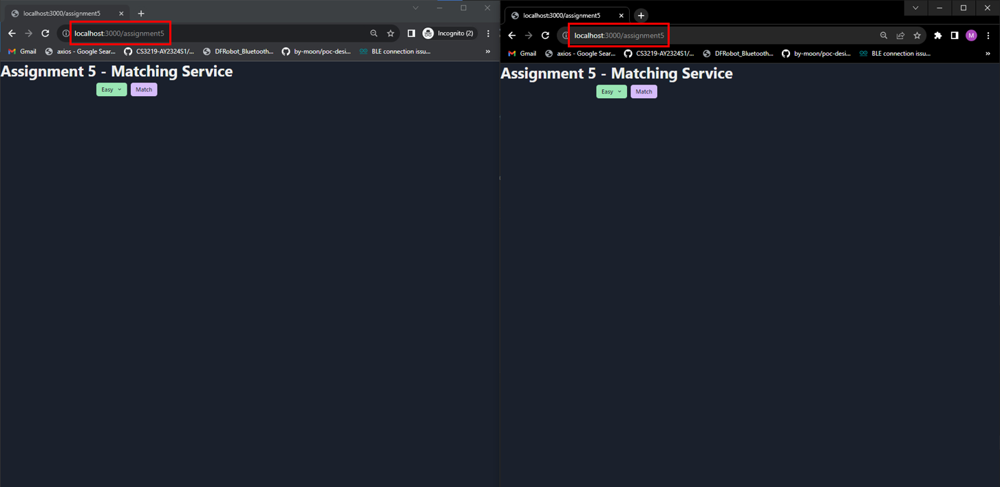
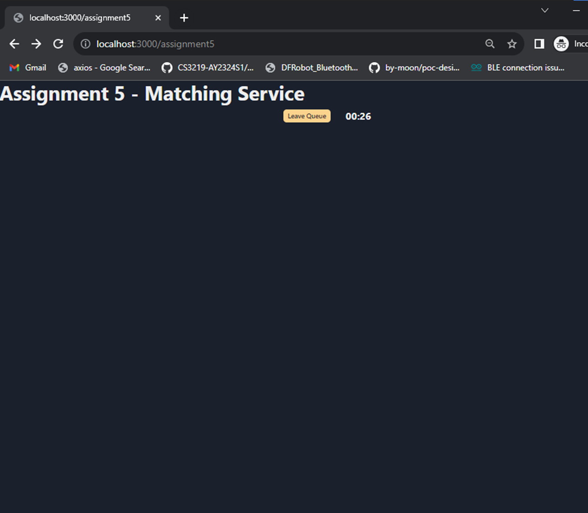
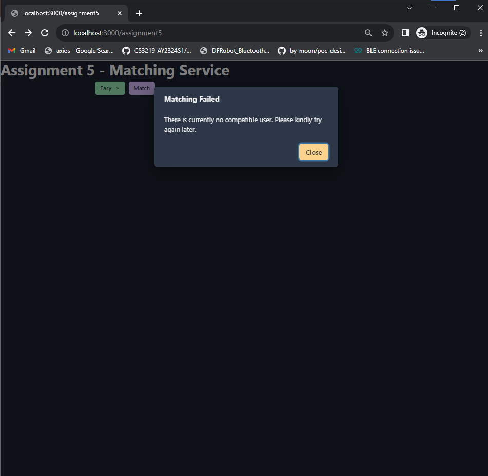
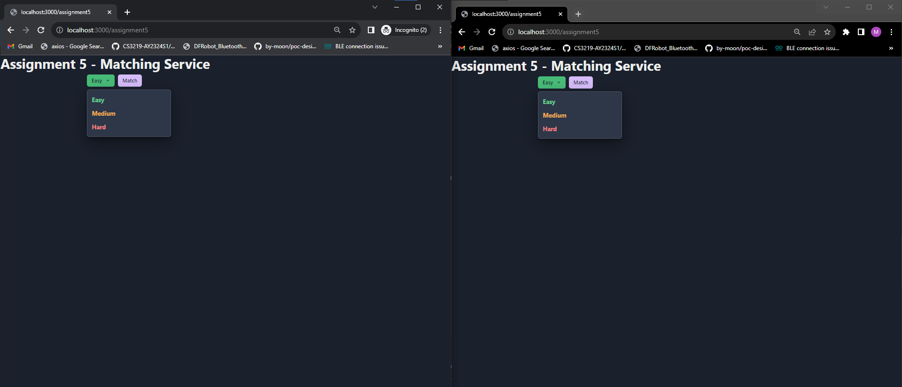
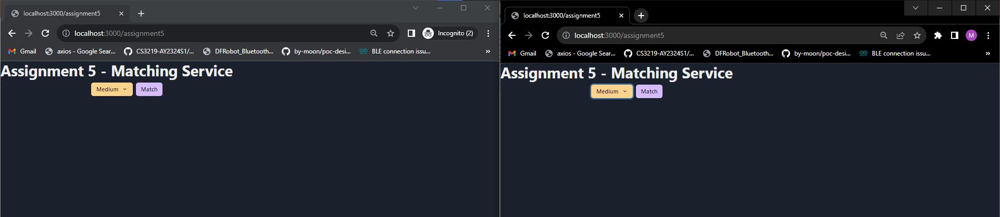
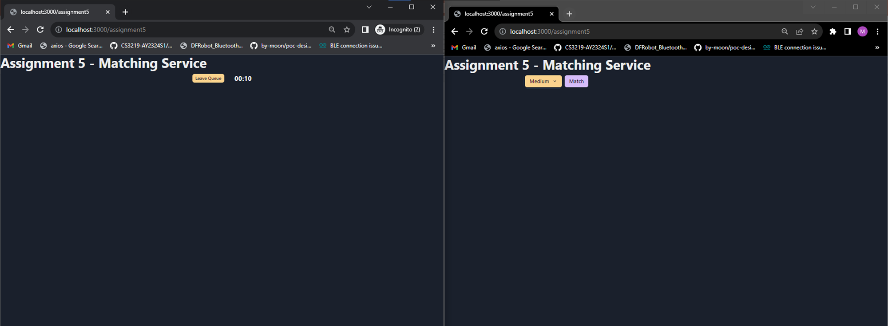
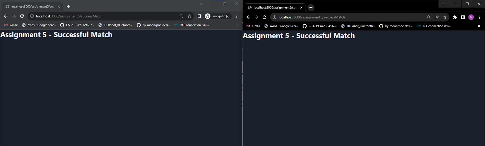

# Assignment 5 Demo Instruction
Outlined below are concise instructions intended to help facilitate with the demonstration and assessment of Assignment 5. These guidelines are designed to help ensure clarity and efficiency during the evaluation process.

## Teck Stack Used
- RabbitMQ
- Socket.IO

## Setting up for Demo
To set up the environment for this project, follow the following steps:

### Prerequisites
Ensure that you have Docker and Docker Compose installed on your machine. If not, you can download and install them from Docker's official website.

### Instructions
1. Open Docker Desktop and ensure that it is running.

2. Open the command prompt.

3. Navigate to the development directory:

On Unix-like systems (including Linux and macOS):
```
cd <path>/ay2324s1-course-assessment-g09/development
```
On Windows:
```
cd <path>\ay2324s1-course-assessment-g09\development
```


4. Run the following command:
```
docker-compose up --build
```
This builds and starts the project containers required for the demo.

5. Open two browser instances (preferably Chrome), one in regular mode and the other in Incognito mode.

6. Visit http://localhost:3000 on both browsers. You'll be redirected to the sign-in page, as illustrated below:



If the page doesn't load immediately or has bad gateway, please be patient and reload after a moment.


7. Log in with the provided sample user accounts on separate browser modes: 
- Email: tankinlian@peerprep.com; Password: 12345678
- Email: ngkoksong@peerprep.com; Password:12345678



Upon successful login, the expected pages will be displayed as shown above.


8. Reroute both pages by entering http://localhost:3000/assignment5. The expected pages should load as shown below.




## Demo

### Failed Matching
1. Select any difficulty and click on match button.

2. Wait for timer to timeout at 30s.



3. Once timeout, the following failed match feedback should display.



4. Close the alert dialog and retry for other difficulties.

5. Close the alert dialog and proceed with successful matching demo.

### Successful Matching
1. Select same difficulty for question, say medium as shown below.








2. Click on match button for one user as seen below.



3. Click on match button for the other user. They should be paired up correctly and redirected to the successMatch page to indicate successful matching as seen below.



You have reached the end of demo for assignment 5. Thank you for your time.

## Assessment Notes for Assignment 5
Code related to assignment 5 can be found in the following directories:
- frontend\pages\assignment5
- backend\matching_service